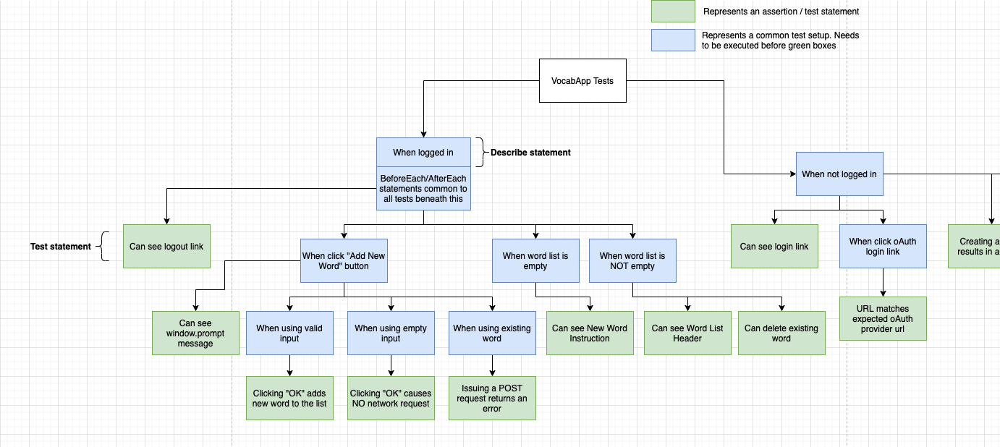

# Vocabulary App 🤓 📚
[](https://travis-ci.com/arpinoda/the-vocab-app)


A web-based “flash card app” created using React.js, Node.js / Express.js, MongoDB, and Redis.


## Demos
#### https://the-vocab-app.herokuapp.com/


## Installation

#### 1. Use [npm](https://docs.npmjs.com/downloading-and-installing-node-js-and-npm) to install all dependencies.

```bash
npm install
```
#### 2. Create an .env file containing the following variables

##### ./.env
```bash
COOKIE_KEY=
DEMO_USER_ID=
DEMO_USER_PW=
GOOGLE_CLIENT_ID=
GOOGLE_CLIENT_SECRET=
MONGODB_URI=
REDIS_URL=
```

##### ./client/.env
```bash
SKIP_PREFLIGHT_CHECK=true
```

#### 3. Start Redis (if not already running as background service)
```bash
% redis-server
```

#### 4. Start the development server
```bash
% npm run dev
```

## Testing / Continuous Integration

```console
% npm run test
```
The solution runs end-to-end integration tests using [Jest](https://jestjs.io/) and [Puppeteer](https://github.com/puppeteer/puppeteer). Commits are synched with [Travis CI](https://www.travis-ci.com/), which builds, tests, and deploys to [Heroku](https://www.heroku.com/).

##### Early test cases


## Miscellaneous
- Supports Google oAuth 2 and Local authentication strategies using Passport.js middleware.
- Dictionary entries fetched via [Free Dictionary API](https://dictionaryapi.dev/)
